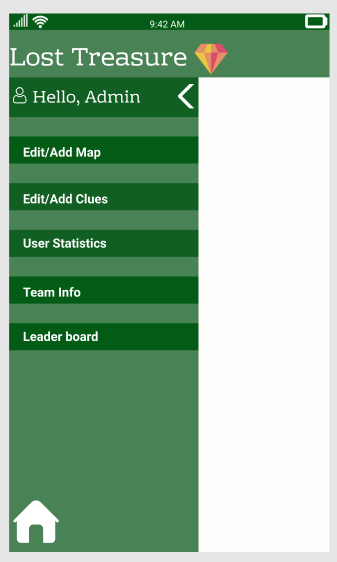

# Lost Treasure:
## Statement of Purpose:
In this app we are going to create a game mainly for the students of Northwest Missouri State University.The main target devices for this game to work on are iPhone SE,laptop,ipad and an Android device.This game helps the bearcats to explore various places on campus and helps in building team work by working in teams.This game is similar to that of treasure hunt. We will take certain area into consideration and make them into blocks mainly identified by means of latitudes and longitudes. Players earn points whenever they reach the set location which is also called as "Destination".Each player can create a team and can play together.They can also enter into a competition and can compete with each other. 

## Game Vision:
We would like to create an app that can be played on a mobile device. The app would encourage players to complete a 'quest' by encountering a specific list of locations. A player would activate one of the locations in the quest. In order to score points, the user must enter the geographic area (as determined by their mobile device). Locations may be explicitly identified (easier) - or described using clues (harder). The quest may require locations to be accessed in a specific order - or in any order as specified by the quest creator.
 

# Team Members and Their Roles
1. Rajeshwari Rudravaram - Team Lead
1. Puneeth Annam - QA Analyst
1. Rohith Chittimalla - Senior Developer
1. Chandrakanth Polisetty - UI Developer
1. Nooka Raju Boddu - Frontend Developer
1. Vishal Reddy Vennavaram - Backend Developer

# Mentor/Client
- Dr. Denise Case
- Assistant Professor, Northwest Missouri State University
- 44-691 Graduate Directed Project

# Consultant
- Dr. Charles Hoot
- Northwest Missouri State University

# Agile Project Link Of Proposal Document in Jira
[Agile Project Link](https://gdp01.atlassian.net/jira/software/projects/AP/boards/3/backlog)

# Assigned Tasks For Team
[Request for Proposal Document](https://github.com/denisecase/rfp-hunt/blob/master/rfp-hunt.md)

# RFP-HUNT GAME

## Mission statement
The main purpose of this treasure hunt game is to develop physical and mental fitness in people.Day-by-day human-beings are becoming lazy due to this COVID-19 pandemic, so by developing these kind of apps one can bring activeness among individuals.

## Overview of this game

- We might want to make an application that can be played on a cell phone. The application would urge players to finish a 'mission' by experiencing a particular rundown of areas. 

- A player would enact one of the areas in the mission. To score that area, the client must enter the geographic territory (as controlled by their cell phone). Areas might be expressly distinguished (simpler) - or depicted utilizing hints (more diligently). The mission may expect areas to be gotten to in a particular request - or in any request as indicated by the journey maker.

## ER Diagram:

 
 ER Diagram for this game consists of various entities like Team,User,Player,competition,Quest,Location.
 * Each user may be part of any number of teams and participate in many competitions.
 * A Team must have one or more Players and even Player can or can not be a part of team.
 * Each Competition should have atleat one Team and Team can be an independent of Competition.
 * Quest must have one or more locations,Location can contain optional quests.
 
 -The ER Diagram shown above consists of the following attributes: User,Team,Quest,Location,Competetion,Player,TeamPlayer,Location of Quest,TeamCompetition.
 
### User Entity:
  The user entity consists of Username as primary key and the other attributes of user consists of Email,password,Datecreated,DateLastaccesed.A user has to register while entering into the game.A registered user may be a part of a single team or may be a part of multiple teams.
 
### Team Entity:
   The entity team has the following attributes: are TeamID as the primary key.The other attributes of this entity are TeamName,Creator,Datecreated,DatelastEdited and the username as the foreign key.

### Quest Entity:
   This entity consists of the following attributes QuestName,designer,datecreated and datelastaccesed. A quest can be created by the user and may provide with clues inorder to reach the location.

### Competition Entity:
   The competition entity has the attributes as CompetitionID as the primary key and competitionName,creator,datecreated,start and end date for the competition.The creator of the competition will specify the start and end time of the competition.
   
### Location Entity:
   Attributes of the location entity are Locationnumber, Locationclue, Locationcoordinates. Locationnumber is the primary key of the entity and location coordinates will help in determining the actual location of the hunt with the help of the location coordinates.
 
### Player Entity:
   A registerd user will act as a player and he can be part of any number of teams.A player entity has the following attributes such as playernickname and points scored.Points  will determined when the player reaches the location based on the clue provided.
 
### LocationofQuest:
   This is an associative entity that has composite primary key that consists of primary keys of both the entities Quest and Location. This has the attributes such as QuestName and Locationnumber.
     
### TeamCompetition:
   TeamCompetition is an associative entity in between Team and Competition entities.This entity has composite primary key made from two entities Team and Competition.This entity has the following attributes as TeamID, CompetitionID and Teamscore which is sum of all the score earned by all the team members.
        
### TeamPlayer Entity:
   This is an associative entity between Team and player. This has a composite primary key made up of TeamID and PlayerID.The remaining attributes of this entity are DateInvited into the team,DateAcceptedInvite,DateRejectedInvite and DateLeftTeam. If a person does not accept the invitation within three days then it will be considered as automatic rejection.
   
   
# Administrator Responsibilities
- The Role of a Administrator is to validate the upcoming features of app and checks whether further modification is necessary or not? If so,then Admin gives permissions to developers for further implementation of app.

# Role of a User 
- A person who can able to access all the information,it can be related to different gaming levels in app i.e primary level ,intermediate level or advanced level or when a player plays the game,he/she can check their individual scores,clues,their current level in that game and can able to see the scores of other players as well to particate more attentively in competition.

# Development Details
- It will take six developers to build the app and deliver the functionality. 
- Developers have been divided the tasks among them. Code reviews, developer testing, and bug fixes are carrying out simultaneously with coding.
- We have one backend devloper, UI design architect and a QA analyst.

# User Stories and Acceptance Criteria
# Sprint 1:
## User story-1
- As a user, a gamer can signup with their email id and they can get into the main game screen.
- As a user, a gamer can reset the password if he forgot the login password.
## Acceptance Criteria:
- This game is designed for the northwest college students and I(Rohith) will take up the task to make sure that everyone with valid email can sign up for this game and also with the username if he/she has already signed up for this game.
## User story-2
- As a user, a player can invite the team members, and the person who invited others members will serve as captain.
## Acceptance Criteria:
- I(Raju) will take this task and make sure that the user can create a team and they can login with registered names, also they can invite other users to join with them and they can be the team captain.
## User story-3
- As a user, a gamer can select if he can play single, duo, or four members.
## Acceptance Criteria:
- I(Raju) as a frontend developer will take up this task and I will develop this application such that the registered user can have an options to play as a team and can invite players to the team if they wish to play in a team, also can play single or duo.
## User story-4
- As a team, the schedule for the project is to be planned for the application.
## Acceptance Criteria:
- I(Rajeshwari) being a Manager, had a meeting with all the team and scheduled was planned accordingly and which is due for presentation.

# Sprint 2:
## User story-5
- As a team, we need to work on risks and assumptions.
## Acceptance Criteria:
- I(Rohith) being a Senior developer, will take this task and with my team will work on assumptions and risks.
## User story-6
- As a user, a gamer can check his level and statistics based on the previous performance.
## Acceptance Criteria:
- I(Puneeth) will take on this role and I will make sure that the players' results and statistics are kept.
## User story-7
- As a user, a gamer can exit the game at any point in time and cannot resume at the same moment.
## Acceptance Criteria:
- I(Vishal) will take this task and make sure of developing the application such that the user can have this option.
## User story-8
- As a developer, I want to organize my work by providing exquisite sketches for the app on how it resembles.
## Acceptance Criteria:
- I(Chandrakanth) being a UI Developer, will take this task and make sure of providing the sketches for the app as client needs it.
## User story-9
- A user can no more exit,if he doesn't participate for a longer peroid of time.
## Acceptance Criteria:
- I(Rajeshwari) act as a admin will take this task and make sure that there is no such data related to non-active players in this app.

# Sprint 3:
## User story-10
- As a team, they will check if all the criteria are successfully be satisfied mentioned in previous sprints. 
## Acceptance Criteria:
- I(Rajeshwari) being the Team Manager, I will check all the criteria and make sure everything is satisfied as mentioned in the previous sprints.
## User story-11
- As a team, they need to test the application and have to provide the bugs to the developers.
## Acceptance Criteria:
- I(Puneeth) being the QA Analyst, I 'm going to take on this role and run all the tests on the application and provide the bugs and check the application for proper functioning.
## User story-12
- As a team, they need to deploy the app and expand to production.
## Acceptance Criteria:
- I(Chandrakanth) will take up this task and with my team we will deploy the application and make sure it will work properly.

## Flow chart of the Application

# App Screens

# Cost Estimation For the Project

# Shedule Management For the Project

# Drawbacks that can occur

- When internet or mobile data is unavailable then the location of the player cannot be traced.
- A Player can not play the game without registration and here the assumption is "Player is accepting all the terms and conditions".
- Score for each task is determined based on reaching the location or marked place within stipulated time.And for groups the score is determined based on the whole performance of individual members.
- Managing the team while playing a game.

# Player Won:

Within the stipulated time player who scores maximum points while reaching maximum locations in less time is considered to be winner.This can be concluded from the sample data entered into player entity.

