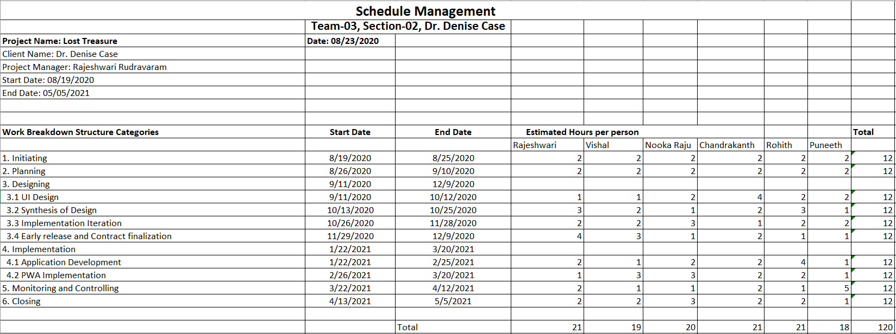

# Lost Treasure:
## Statement of Purpose:
In this app we are going to create a game mainly for the students of Northwest Missouri State University.The main target devices for this game to work on are iPhone SE,laptop,ipad and an Android device.This game helps the bearcats to explore various places on campus and helps in building team work by working in teams.This game is similar to that of treasure hunt. We will take certain area into consideration and make them into blocks mainly 10x10. Players earn points whenever they reach the set location which is also called as "Destination".Each player can create a team and can play together.They can also enter into a competition and can compete with each other. 

## Game Vision:
We would like to create an app that can be played on a mobile device. The app would encourage players to complete a 'quest' by encountering a specific list of locations. A player would activate one of the locations in the quest. In order to score points, the user must enter the geographic area (as determined by their mobile device). Locations may be explicitly identified (easier) - or described using clues (harder). The quest may require locations to be accessed in a specific order - or in any order as specified by the quest creator.
 

# Team Members and Their Roles
1. Rajeshwari Rudravaram - Team Lead
1. Puneeth Annam - QA Analyst
1. Rohith Chittimalla - Senior Developer
1. Chandrakanth Polisetty - UI Developer
1. Nooka Raju Boddu - Backend Developer
1. Vishal Reddy Vennavaram - Frontend Developer

# Mentor/Client
- Dr. Denise Case
- Assistant Professor, Northwest Missouri State University
- 44-691 Graduate Directed Project

# Consultant
- Dr. Charles Hoot
- Northwest Missouri State University

# Jira Project Link Of Proposal Document
[Jira Project Link](https://gdp01.atlassian.net/secure/RapidBoard.jspa?rapidView=1&projectKey=GH&selectedIssue=GH-6)

# Sprints in Jira of Lost Treasure app
User stories
### Sprint1

### Sprint2

### Sprint3

# Given Tasks
[Request for Proposal Document](https://github.com/denisecase/rfp-hunt/blob/master/rfp-hunt.md)

# RFP-HUNT GAME

## Mission statement
The main purpose of this treasure hunt game is to develop physical and mental fitness in people.Day-by-day human-beings are becoming lazy due to this COVID-19 pandemic, so by developing these kind of apps one can bring activeness among individuals.

## Overview of this game

- We might want to make an application that can be played on a cell phone. The application would urge players to finish a 'mission' by experiencing a particular rundown of areas. 

- A player would enact one of the areas in the mission. To score that area, the client must enter the geographic territory (as controlled by their cell phone). Areas might be expressly distinguished (simpler) - or depicted utilizing hints (more diligently). The mission may expect areas to be gotten to in a particular request - or in any request as indicated by the journey maker.

## ER Diagram:

 
 ER Diagram for this game consists of various entities like Team,User,Player,competition,Quest,Location.
 * Each user may be part of any number of teams and participate in many competitions.
 * A Team may or may not have Players and even Player can or can not be a part of team.
 * Competition can be independent of Team and Team can also be a independent of Competition.
 * Quest can contain zero or many locations,Location can contain optional quests.
 The ER Diagram shown above consists of the following attributes.They are User,Team,Quest,Location,Competetion,Player,TeamPlayer,Location of Quest,TeamCompetition.
 
### User Entity:
  The user entity consists of Username as primary key.The other attributes of user consists of Email,password,Datecreated,DateLastaccesed.A user has to register while entering into the game.A registered user may be a part of a single team or may be a part of multiple teams.
 
### Team Entity:
   The entity team has the following attributes.They are TeamID as the primary key.The other attributes of this entity are TeamName,Creator,Datecreated,DatelastEdited and the username as the foreign key.

### Quest Entity:
   This entity consists of the following attributes QuestName,designer,datecreated and datelastaccesed. A quest can be created by the user and may provide with clues inorder to reach the location.

### Competition Entity:
   The competition entity has the attributes as CompetitionID as the primary key. and competitionName,creator,datecreated,start and end date for the competition.The creator of the competition will specify the start and end time of the competition.
   
### Location Entity:
   Attributes of the location entity are Locationnumber, Locationclue, Locationcoordinates. Locationnumber is the primary key of the entity and location coordinates will help in determining the actual location of the hunt with the help of the location coordinates.
 
### Player Entity:
   A registerd user will act as a player and he can be part of any number of teams.A player entity has the following attributes such as playernickname and points scored.Points  will determined when the player reaches the location based on the clue provided.
 
### LocationofQuest:
   This is an associative entity that has composite primary key that consists of primary keys of both the entities Quest and Location. This has the attributes such as QuestName and Locationnumber.
     
### TeamCompetition:
   TeamCompetition is an associative entity in between Team and Competition entities.This entity has composite primary key made from two entities Team and Competition.This entity has the following attributes as TeamID, CompetitionID and Teamscore which is sum of all the score earned by all the team members.
        
### TeamPlayer Entity:
   This is an associative entity between Team and player. This has a composite primary key made up of TeamID and PlayerID.The remaining attributes of this entity are DateInvited into the team,DateAcceptedInvite,DateRejectedInvite and DateLeftTeam. If a person does not accept the invitation within three days then it will be considered as automatic rejection.
   
   
# Administrator Responsibilities
- A person who can authenticate and can authorize regarding this app.

# Role of a User 
- A person who can able to fetch all the information about the app.

# Development Details
- It will take six developers to build the app and deliver the functionality. 
- Developers have been divided the tasks among them. Code reviews, developer testing, and bug fixes are carrying out simultaneously with coding.
- We have one backend devloper, UI design architect and a QA analyst

# User Aceptance Criteria
- A player or a user need to enter all the mandatory feilds in the app for signing up the app for the first time.
- While logging into an existing account a player must and should enter all the text-feilds such as email and password.
- If a player doesn't play a game for more than 15 mins then his/her account will be auto-logged out from app or browser.
- This app is a responsive design which works on all the devices like Android mobile or ios,ipad,laptop or desktop.
- If a player forgot his/her password then that person can reset the password by entering the email-id after clicking on forgot password.

# User Stories
# Module 1:
- As Rajeshwari, I would like to invite my team members to know the blueprints of the businesses. 
- As Raju, I would like to write a description of the app criteria and information.
- As Chandu, I want to organize my work by providing exquisite sketches for the app on how it resembles.
- As Vishal, I would like to create the back-end database by implementing entity-relationship, the backbone of   the app.
- As Puneeth, I would work on the schedule management.
- As  Rohith, I would work on risks and assumptions.

# Module 2:
- The manager creates a budget schedule based on the roles of the developer.
- Acceptance criteria are the principal subject for end-user in which the game scheme.

# Module3:
- QA analysts and developers are ready to deploy the app and test for bugs and expand to production.

# App Screens

# Cost Estimation For the Project

# Shedule Management For the Project

# Drawbacks that can occur

- When internet or mobile data is unavailable then the location of the player cannot be traced.
- A Player can not play the game without registration and here the assumption is "Player is accepting all the terms and conditions".
- Score for each task is determined based on reaching the location or marked place within stipulated time.And for groups the score is determined based on the whole performance of individual members.

# Player Won:
Within stipulated player who scores maximum points is less time is considered to be winner.This can be concluded from the sample data entered into player entity.

