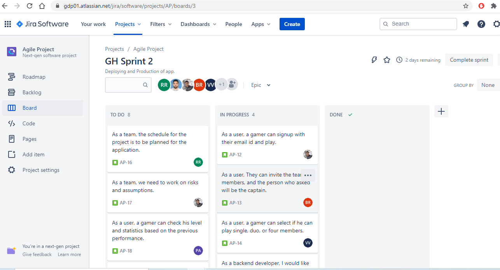

# Module 1:Individual 1

I'm Rajeshwari Rudravaram acting as a Team Lead of Project named "LOST TREASURE" which is a geo-enabled app.
Dr.Denis Case is our client and our project consultant is Dr.Charles Hoot.
Our team consists of 6 members,where each team member has their individual roles and assigned tasks for each sprint.

### My detailed description of tasks which are in progress under this project are as follows:

## List of classes I have attended:
* Half Day 1: 08/21/2020 - attended Inperson
* Half Day 2: 08/24/2020 - attended through Zoom meeting
* Half Day 3: 08/26/2020 - attended Inperson

## Half Day 1: 

* I had a discussion with all the team members related to gaming-app and assigned each role and distributed the responsibilities to each member in our group.
* In the early hours on this day,I have created a repository in Github and added all my team members as contributors.
     * [Repo Created](https://github.com/Rajeshwari-Rudra/GDP1/tree/6ceace582c1642ba8d4a858f42db31013bdb9d5e).

* I have sent an invitation link to all the team members
   * https://github.com/Rajeshwari-Rudra/GDP1/graphs/contributors
* In the post lunch,we have analyzied the client's requirements according to that we have designed a suitable and cost-effective app.
* We have concluded the app name as "LOST TREASURE" and finalized some UI sketches to address the client's need.
   
   
## Half Day 2:

* I have initiated my day by signing-up a new Jira account which helps us to plan and manage the tasks in this project easily.
* Later on created a new project name "Game Hunt" then added all members of our group into it.
* Added ["Agile Project link of jira"](https://github.com/Rajeshwari-Rudra/GDP1/commit/e1c44c1cf81a45bfc10c6e1b2a035e62eb59e57b) in Markdown.
* I have developed a document of Request for proposal according to client:

    * https://github.com/Rajeshwari-Rudra/GDP1/blob/master/README.md
             
* Updated the description related to game such as "Assigned tasks for Team" by creating user roles.
* "Mission statement" which gives the main purpose of this app and "Overview of this game" to get an idea of what our gaming-app is related to:

    * https://github.com/Rajeshwari-Rudra/GDP1/commit/e1c44c1cf81a45bfc10c6e1b2a035e62eb59e57b
         
* The Data schemas,some complete sets of sample data,files were modified based on ER diagram and location Quest was added 

    * https://github.com/Rajeshwari-Rudra/GDP1/commit/43985598fb27b9b124a7169834238f379ecd78bc
        
* Brief decription on ER diagram and added some risks and assumptions of this app to Markdown file.

     * https://github.com/Rajeshwari-Rudra/GDP1/commit/9a22846adbf96bc81d619c0261911660ffb1f136
     * https://github.com/Rajeshwari-Rudra/GDP1/commit/8a0595da8adfe84dab9b5897dc9ce82c3453cafb
     
 *  Updated the Jira account by adding some sprints and user stories into it.
 
       * https://github.com/Rajeshwari-Rudra/GDP1/commit/4b418866a07a049e88e15c71d8ab5aef149f841b
   
  ## Half Day 3:
  
  * In the early hours,I have divided some of the responsibilities and group roles for acceptance criteria checklist by all possible methods.
  
  * Edited the screenshots of Jira from Markdown file based on some completed tasks and in-progress and to-do list.
  
       * https://github.com/Rajeshwari-Rudra/GDP1/commit/5ab2a2d0ebcfb7eb6cfedc8944d34849c53b5580
          
   * Added a new agile Product in Jira by updating the user stories and tasks to relevant to current sprint in Agile-Project on AP board:
   
        * https://github.com/Rajeshwari-Rudra/GDP1/commit/e0ff9e5cc0ba4eadabfb2a80aab4154f1dd7e842
    
   
 
